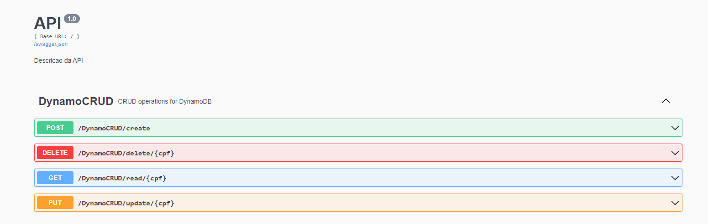
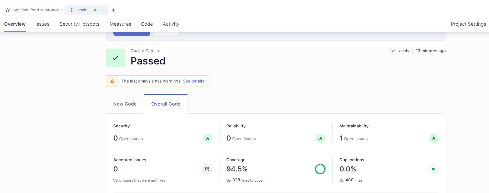
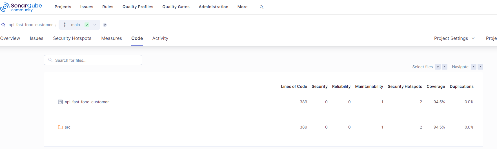
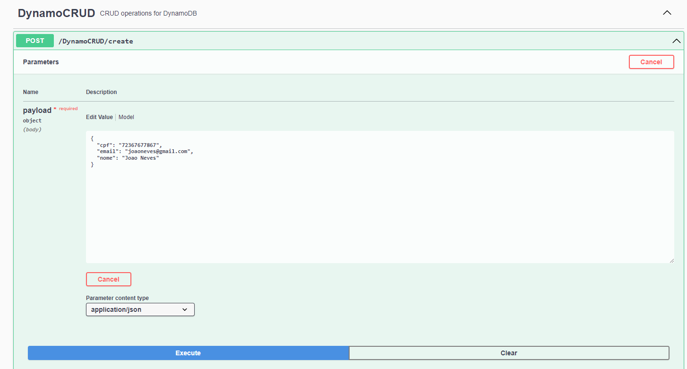
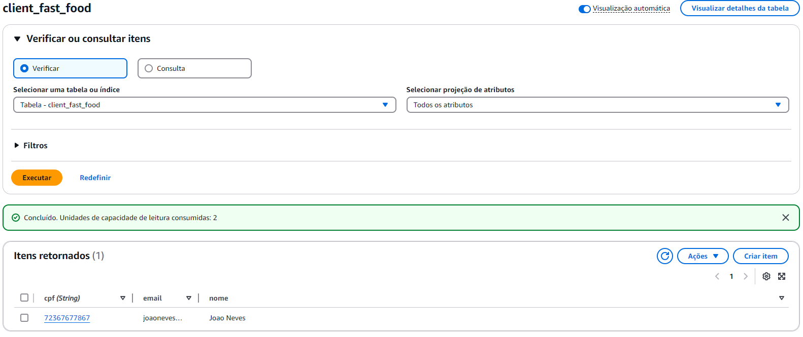

# API Fast Food Customer

Este é um projeto de aplicação desenvolvido em Python 3.12. 

## Objetivo

Esta aplicação tem como objetivo cadastrar os usuários da aplicação dentro de um DynamoDB da AWS, realizando operações de CRUD (Create, Read, Update, Delete).
A aplicação possui um Swagger disponível na porta 3000. Para acessar, basta rodar o código e acessar de forma local http://localhost:3000/swagger/ ou em caso produtivo http://{HOST}:3000/swagger/.



##  Executando a Aplicação
#### Requisitos

- Python 3.12
- pip

#### Instalação

Para instalar as dependências necessárias, execute o seguinte comando apontando para o arquivo `requirements.txt`:

```bash
pip install -r requirements.txt
````    

####  Execução
Para executar a aplicação, utilize o comando:
```bash
python src/app.py
````

##  Testes Unitários
Está aplicação também conta com testes unitarios, que estão localizados na pasta tests. Vale ressaltar que os testes unitarios estão utilizando o pytest e pytest-cov para analisar a cobertura de codigo, e por conta disso, para rodar os testes unitarios é necessario instalar as dependencias abaixo:
````    
pip install pytest
pip install pytest-cov
````

Para Analisar o codigo local e verificar a porcentagem de cobertura em cada arquivo, pode rodar o comando abaixo:
````
coverage3 run -m pytest -v --cov=. 
````

Caso queria verificar os testes dentro do sonnar, basta rodar os comandos do covarage e da geracao do arquivo covarerage.xml e depois rodar o sonnar-scanner
````
coverage3 run -m pytest -v --cov=. --cov-report xml:coverage.xml
sonar-scanner
````




##  Integração e Deploy
Para realizar o deploy desta aplicação, foi utilizado  a integração do GitHub Actions, permitindo fazer o deploy diretamente na AWS, utilizando os arquivos Kubernetes presentes na pasta K8S. Para subir a imagem em ambiente produtivo, estamos utilizando o AWS ECR.

## Demonstração
Na imagem abaixo, é possivel ver a aplicação rodando em um ambiente produtivo, realizando o cadastro de um novo usuario.



OBS: Caso alguma alteração no projeto seja feita, é de estrema importancia atualizar as dependencias do projeto, e para isso pode usar o seguinte comando
````
pip freeze > requirements.txt
````
